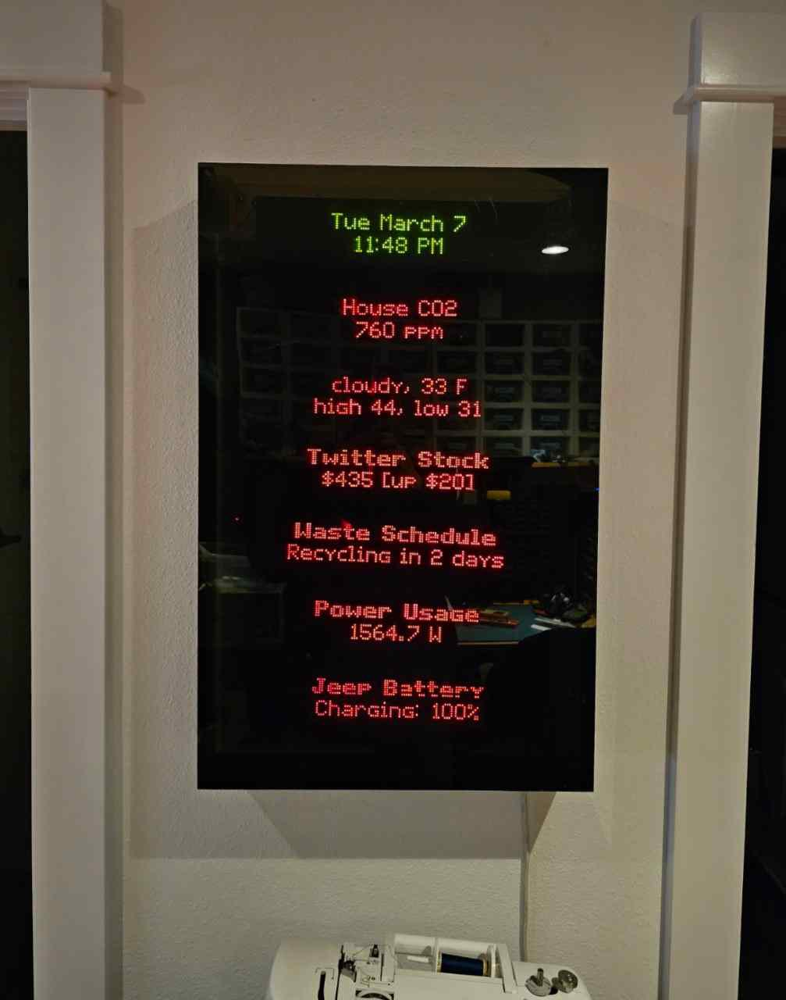

# esphome_alpha_led_sign
Alpha LED Sign library for ESPHome



This whole thing is a huge hack so no big expectations!

For now, use the Hacky Implementation, but the TODO is to make this a proper ESPHome-importable library.

## Alpha Sign theory of operation
To display content on an Alpha sign, your content must be in a Page.
Pages on Alpha signs are given single-character labels. Any character from A-Z, a-z, 0-9 and a few special characters are acceptable.
A Page consists of a series of letters, representing the text to display.

Special control codes can be inserted into the page to change font, colors, transitions, effects, etc.

To display dynamic information, which is information that changes without having to reprogram the whole sign, 
we use a feature of the Alpha sign called a `string`.

Like pages, strings have identifiers from A-Z, a-z, etc. You use a special control code to 
insert a string into your page.  In fact, if you want, your page can be entirely just one string. 
Strings are limited to 255 characters, and their memory allocation has to be defined at programming time.

Once programmed, a string's value can be updated at runtime and the sign will display the new value immediately.

## Hacky Implementation:

This implementation creates a series of pages and uses strings to display custom text on the pages that can be updated in real time.

The whole thing is designed to drive seven of these signs at the same time, using the Serial Address 
feature to drive them all over the same serial port.  But you can use this for just one sign 
connected via RS-232.

### Files

- **example_esphome.yaml**: Use this to create the ESPHome config for your signs. 
This file contains the code that glues Home Assistant to the next file. 
- **seven_signs.h**: The actual implementation of what the sign can do.  
Sets up the memory pages, string buffers, etc.  You should check out the official
Alpha Sign Communications Protocol to really understand how to use this.
- **alpha_sign.h** A terrible implementation of the Alpha Sign communications library, 
mostly just converted from my decades-old VB code.  It's not pretty but it works.

### Installation
1. Copy the two .h files into your `esphome` directory in Home Assistant.
2. Create a new device in ESPHome and paste in the yaml.
3. Create several text helper entities in Home Assistant. 
I created ones called `s7_line1top`, `s7_line1bot`, and `s7_line1mode`.
These represent the top text, bottom text, and mode.

1. Upload to the ESP.

### Usage

Set the Mode for each sign to one of the following values:

-  **Time**: Displays the current time.
-  **Text**: Displays regular text on both lines. 
-  **Header**: Displays a bold header on the top line and regular text on the bottom line 
-  **OneLine**: Displays the text across both lines, scrolling up to fit
-  **Scroll**: Text scrolls horizontally
-  **Twinkle**: Text twinkles continuously
-  **Slots**: Makes it play a slot machine animation 

Any text you set into `input_text.s7_line1top` will appear on the top line of Sign 1, 
assuming that you set it to a mode that will display it.

Now, you can create automations in Home Assistant to update the text as you wish.


For example here is an automation that sets the current weather on the sign every minute.
```yaml
alias: Set Weather on Sign
description: ""
trigger:
  - platform: time_pattern
    minutes: /1
condition: []
action:
  - data:
      value: >-
        {{ states('weather.avhome') }}, {{state_attr('weather.avhome',
        'temperature')}} F
    target:
      entity_id: input_text.s7_line3top
    action: input_text.set_value
mode: single
```

## Additional reading

Alpha Sign Communications protocol: https://www.alpha-american.com/p-alpha-communications-protocol.html